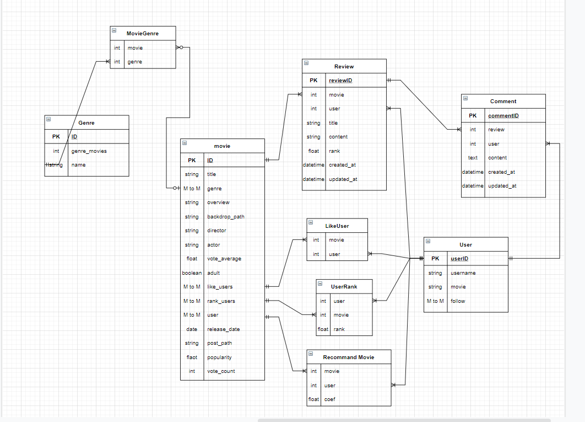

# 영화추천 알고리즘(2021/11/17(수))

### 프로젝트 이름 : MovieDream ( 무비드림 )

## 👥 팀원 및 업무 분담

**Hyun Jin Ryu & Geon Woo Noh**

- 류현진: 프론트엔드 담당 - 화면 설계 및 디자인, Vue Cli 및 Axios를 통한 REST API 활용
- 노건우: 백엔드 담당 - DB/ Django REST API 설계, Vue Cli 및 Axios 로직 구현

- 영화 데이터 수집 방식 

 	The Movie Database (TMDB) , api

### 사용할 아키텍처

- Django REST API
- Vue.js

## ⭐️ 핵심 기능

### 요구사항 

##### 아래의 세부 요구사항은 필수 기능으로 프로젝트 내에 반드시 포함되어야 합니다. 이 외의 추가적인 기능 및 디자인 등은 팀 별로 자유롭게 수행할 수 있습니다. 

#### A. 관리자 뷰 

i. 관리자 권한의 유저만 영화 등록/수정/삭제 권한을 가집니다.

ii. 관리자 권한의 유저만 유저 관리 권한을 가집니다. 

iii. 장고에서 기본적으로 제공하는 admin 기능을 이용하여 구현합니다. 

iv. Vue.js를 활용하는 경우에도 Django admin기능을 이용하여 구현할 수 있습니다. 

#### B. 영화 정보

i. 영화 정보는 Database Seeding을 활용하여 최소 50개 이상의 데이터가 존재하도록 구성해야 합니다. 

ii. 모든 로그인 된 유저는 영화에 대한 평점 등록/수정/삭제 등을 할 수 있어야 합니다. 

#### C. 추천 알고리즘 

1. 이미 본 영화는 추천알고리즘에서 제외
2. 프로필에 기입한 장르로 추천하기
3. 좋아요 +  조회수, 댓글,좋아요를 점수화해서 추천하기.

1. 팔로우한 유저가 좋아요,최근시청한 영화 목록, 리뷰남긴

   if 팔로우 유저가 ==0:

      -> 팔로우 한 유저가 없습니다. 팔로우 할 유절르 찾으러 가시겠습니까

   ​       -> 인스타그램처럼

#### D. 커뮤니티 

i. 영화 정보와 관련된 대화를 할 수 있는 커뮤니티 기능을 구현해야 합니다. 

ii. 로그인한 사용자만 글을 조회/생성할 수 있으며 작성자 본인만 글을 수정/삭제 할 수 있습니다. 

iii. 사용자는 작성된 게시 글에 댓글을 작성할 수 있어야 하며, 작성자 본인만 댓글을 삭제할 수 있습니다. 

iv. 각 게시글 및 댓글은 생성 및 수정 시각 정보가 포함되어야 합니다. 

 자유게시판

> title, userid(FK) , content, 작성시간

영화추천 게시판

> title, userid(FK) , 작성시간
>
> 장르 선택, 영화 선택, 제목, 평점, 내용

공통부분 좋아요, 댓글

#### 검색기능

-> 영화 제목, 줄거리  키워드검색

#### E. 기타 

i. 최소한 5개 이상의 URL 및 페이지를 구성해야 합니다. 

ii. HTTP Method와 상태 코드는 상황에 맞게 적절하게 반환되어야 하며, 필요에 따라 메시지 프레임워크 등을 사용하여 에러 페이지를 구성해야 합니다. 

iii. 필요한 경우 Ajax를 활용한 비동기 요청을 통해 사용자 경험을 향상 시켜야 합니다.

## 데이터 모델링

일단 설계는 이정도에서 마무리했는데 추가해야할 부분이 있으면 계속 수정해 나갈 예정이다.

  

### (2021/11/18(목) 오전회의

* 데이터모델링 수정

* vue + django   :  accounts login signup logout기능 구현
* movie ,community 까지 기본적 기능 구현하기 .

# 

community, review 기능 구현 및 Serialize 완료. 

view 로그인, 로그아웃, 게시판 router 설정 및 토큰 인증방식 적용 완료.

# 

### (2021/11/19(금) 오전회의

#### 페이지 기획 및 프로토타입 제작 (발사믹)

+ 뷰, 장고 게시판 및 리뷰 기능 구현.

### (2021/11/22(월) 오전회의)

* 뷰, 장고 게시판 및 리뷰 기능 구현. 마무리하기
* 뷰, 장고  
