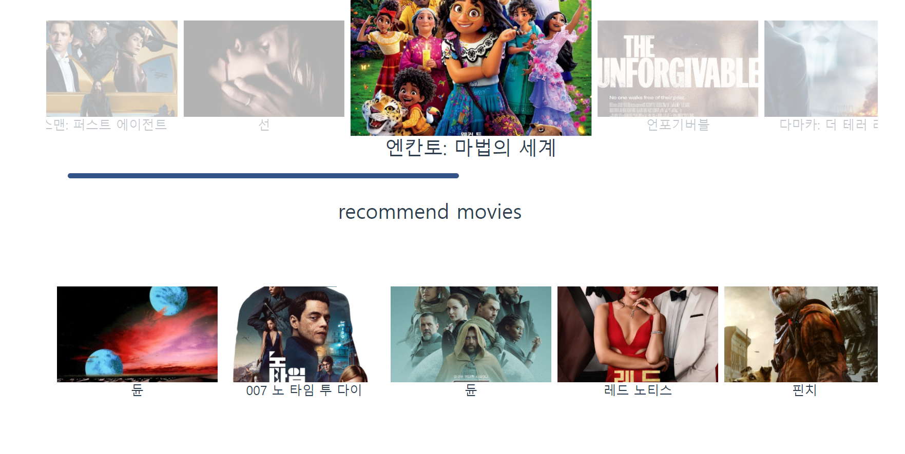
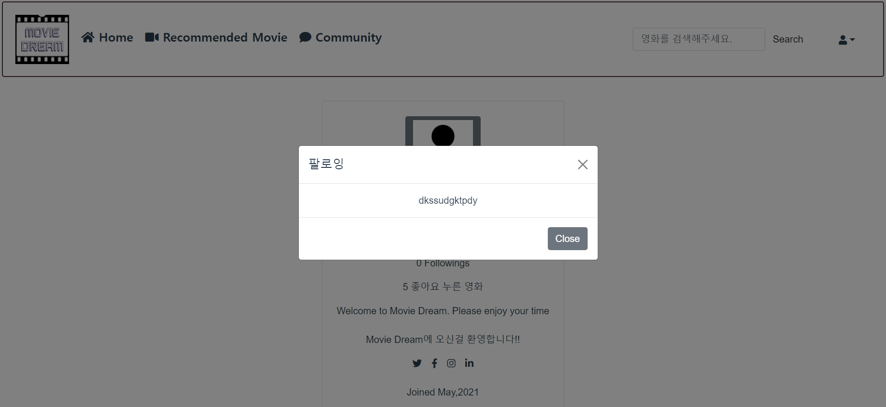
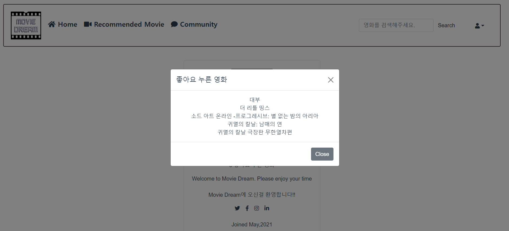

# 영화추천 알고리즘


## 프로젝트 이름 : MovieDream ( 무비드림 )


## 👥 팀원 및 업무 분담

**Hyun Jin Ryu & Geon Woo Noh**

- 류현진: 프론트엔드 담당 - 화면 설계 및 디자인, Vue Cli 및 Axios를 통한 REST API 활용
- 노건우: 백엔드 담당 - DB/ Django REST API 설계, Vue Cli 및 Axios 로직 구현

- 영화 데이터 수집 방식 

 	The Movie Database (TMDB) , api


### 사용할 아키텍처

- Django REST API
- Vue.js


## ⭐️ 핵심 기능

### 요구사항 

##### 아래의 세부 요구사항은 필수 기능으로 프로젝트 내에 반드시 포함되어야 합니다. 이 외의 추가적인 기능 및 디자인 등은 팀 별로 자유롭게 수행할 수 있습니다. 


#### A. 관리자 뷰 

i. 관리자 권한의 유저만 영화 등록/수정/삭제 권한을 가집니다.

ii. 관리자 권한의 유저만 유저 관리 권한을 가집니다. 

iii. 장고에서 기본적으로 제공하는 admin 기능을 이용하여 구현합니다. 

iv. Vue.js를 활용하는 경우에도 Django admin기능을 이용하여 구현할 수 있습니다. 


#### B. 영화 정보

i. 영화 정보는 Database Seeding을 활용하여 최소 50개 이상의 데이터가 존재하도록 구성해야 합니다. 

ii. 모든 로그인 된 유저는 영화에 대한 평점 등록/수정/삭제 등을 할 수 있어야 합니다. 


#### C. 추천 알고리즘 

1. 이미 본 영화는 추천알고리즘에서 제외
2. 프로필에 기입한 장르로 추천하기
3. 좋아요 +  조회수, 댓글,좋아요를 점수화해서 추천하기.


1. 팔로우한 유저가 좋아요,최근시청한 영화 목록, 리뷰남긴

   if 팔로우 유저가 ==0:

      -> 팔로우 한 유저가 없습니다. 팔로우 할 유절르 찾으러 가시겠습니까

   ​       -> 인스타그램처럼


#### D. 커뮤니티 

i. 영화 정보와 관련된 대화를 할 수 있는 커뮤니티 기능을 구현해야 합니다. 

ii. 로그인한 사용자만 글을 조회/생성할 수 있으며 작성자 본인만 글을 수정/삭제 할 수 있습니다. 

iii. 사용자는 작성된 게시 글에 댓글을 작성할 수 있어야 하며, 작성자 본인만 댓글을 삭제할 수 있습니다. 

iv. 각 게시글 및 댓글은 생성 및 수정 시각 정보가 포함되어야 합니다. 


 자유게시판

> title, userid(FK) , content, 작성시간
>
> 게시판 댓글(익명)


#### 검색기능

저장데이터 기반 title, overview에 포함된 단어 검색 기능


#### E. 기타 

i. 최소한 5개 이상의 URL 및 페이지를 구성해야 합니다. 

ii. HTTP Method와 상태 코드는 상황에 맞게 적절하게 반환되어야 하며, 필요에 따라 메시지 프레임워크 등을 사용하여 에러 페이지를 구성해야 합니다. 

iii. 필요한 경우 Ajax를 활용한 비동기 요청을 통해 사용자 경험을 향상 시켜야 합니다.


## 데이터 모델링


일단 설계는 이정도에서 마무리했는데 추가해야할 부분이 있으면 계속 수정해 나갈 예정이다.

  


## 페이지 기획 및 프로토타입 제작 (발사믹)


# 구현 및 테스트


### 로그인


> 로그인은 토글방식을 사용하며 회원정보가 일치하지 않을시 
>
> alert ('회원정보가 존재하지 않습니다! 회원가입을 진행해주세요.') 알림


#### 회원가입


```javascript
        .catch(err => {
          console.log(err)
          if (this.credentials.password!==this.credentials.passwordConfirmation){
            alert('비밀번호를 다시 확인해주세요.')
          }
          else if(this.credentials.password.length <= 8){
            alert('비밀번호가 너무 짧습니다.')
          }
          else{
            alert('아이디가 이미 존재합니다.')
          }
```

>회원가입은 
>
>비밀번호가 다르면 비밀번호 확인알림, 비밀번호 8자리이상, 그외에는 회원가입 정보 중복 으로 넘겼다.


#### 홈화면


>홈화면 
>
>nav bar에 홈, 영화추천, 커뮤니티(자유게시판)    ㅣ    검색창, 프로필( 프로필이동, 로그아웃) 모달기능 
>
>을 구성했다.


#### 영화추천


> 영화 추천 기능
>
> API로 받아온 데이터를 기준으로 평점순, 최신영화순 추천기능을 제공한다.



* 업데이트 2022.1.13

  api 기반 평점, 최신영화순 영화 추천기능 + 자체 알고리즘 추천 서비스로

  좋아요누른 영화, 최근 평점, 조회수, 여러가지 정보를 바탕으로 추천영화 10개를 제공 


#### 영화추천 / 디테일


>영화를 클릭하면 디테일 페이지로 이동하며 영화에대한 설명과 좋아요기능, 리뷰기능이 구현되어 있다.
>
>리뷰는 별점과 간단한 코멘트를 작성할 수 있으며 작성자만 삭제할 수 있다.


#### 영화 리뷰 작성


#### 자유게시판


>자유게시판은 페이지당 10개씩 구성되도록 페이지네이션이 적용되어있고  게시글 작성 모달을 통하여
>
>게시글을 작성할 수 있다. 작성이후 디테일페이지로 라우팅된다.


#### 게시글 작성


#### 게시글 디테일


>게시글 디테일 페이지에는 게시글제목, 작성일자, 작성자, 내용이 표시되며
>
>익명으로 댓글을 작성할 수 있다.


#### 검색기능


>검색어를 저장된 DB에서 'title', 'overview'가 포함된 리스트를 반환하여 출력한다.
>
>검색어를 입력하지 않으면 검색어를 1자이상 입력하라는 알림이 뜬다.


#### 프로필


>프로필기능 
>
>프로필에는 
>
>username , follwer, following , 좋아요누른 영화 수가 표기됩니다.


#### 




> 프로필에서 팔로워, 팔로잉, 좋아요 누른 영활르 클릭하면 상세정보를 확인할 수 있습니다.


# 프로젝트 시연영상

<video src="https://user-images.githubusercontent.com/87456351/146037690-ebc3b2b0-3b3f-4e66-964b-9a76b62db753.mp4"></video>


# 배포  (진행중)


> 프로젝트는 계속 유지보수 중에 있으며 지속적인 기능 추가가 이루어 지고 있습니다.
>
>리팩토링 이후 AWS를 통한 배포를 진행 계획중에 있습니다.


##### LAST UPDATE : 22/01/05
